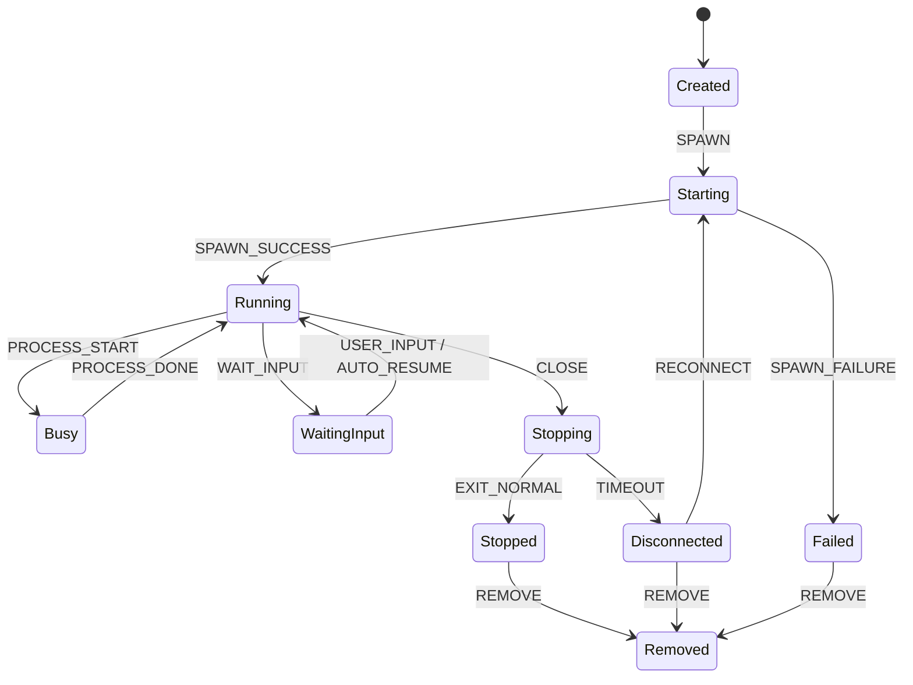
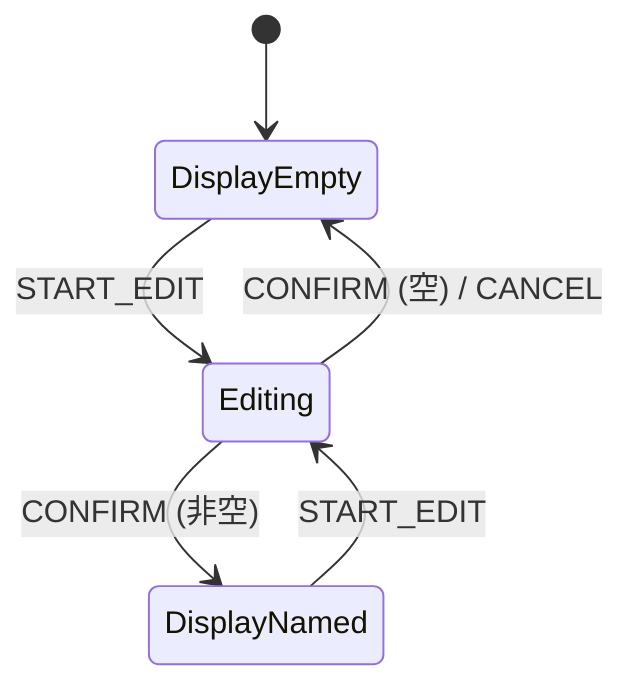

# 附录 A：状态机定义（共享层，不改动）

> **所属 PRD**：Muxvo 终端 Tab — 前端 UI 重写
> **文件类型**：附录

> **范围声明**：本附录定义的状态机位于 `src/shared/machines/`，属于共享层代码，**不在本次前端重写范围内**。前端组件消费这些状态进行 UI 渲染，但不修改状态机本身的定义和转换逻辑。

前端通过 `onStateChange` Push 事件接收状态变化，通过 `terminal-process-ui-map.ts` 映射为 UI 表现（颜色、动画）。状态机的状态定义和转换规则在此列出，供前端开发参考。

---

## A.1 终端进程状态机

### A.1.1 状态图



### A.1.2 状态定义

| 状态 | 说明 | 进入条件 |
|------|------|---------|
| `Created` | 终端对象已创建，PTY 尚未启动 | 初始状态（`terminal:create` 调用后） |
| `Starting` | PTY 正在 spawn | 收到 `SPAWN` 事件 |
| `Running` | PTY 已启动，等待用户输入或执行中 | `SPAWN_SUCCESS` / `PROCESS_DONE` / `USER_INPUT` / `AUTO_RESUME` |
| `Busy` | 有前台子进程正在执行 | `PROCESS_START`（检测到前台进程变化） |
| `WaitingInput` | AI CLI 等待用户确认 | `WAIT_INPUT`（检测到等待输入模式） |
| `Stopping` | 正在优雅关闭（发送 SIGTERM） | `CLOSE` 事件 |
| `Stopped` | PTY 已正常退出 | `EXIT_NORMAL`（收到退出码） |
| `Disconnected` | 优雅关闭超时，PTY 失联 | `TIMEOUT`（5 秒超时） |
| `Failed` | PTY spawn 失败 | `SPAWN_FAILURE`（spawn 返回错误） |
| `Removed` | 终端已从列表移除 | `REMOVE`（用户确认移除或自动清理） |

### A.1.3 完整转换表

| 当前状态 | 事件 | 目标状态 | 副作用 |
|---------|------|---------|--------|
| `Created` | `SPAWN` | `Starting` | 调用 `pty.spawn()`（后端，不变） |
| `Starting` | `SPAWN_SUCCESS` | `Running` | 推送 `terminal:state-change`（后端，不变） |
| `Starting` | `SPAWN_FAILURE` | `Failed` | 记录错误信息，推送状态变化（后端，不变） |
| `Running` | `PROCESS_START` | `Busy` | 更新 `processName`，推送状态变化（后端，不变） |
| `Running` | `WAIT_INPUT` | `WaitingInput` | 触发 WaitingInput 视觉通知（前端渲染） |
| `Running` | `CLOSE` | `Stopping` | 发送 SIGTERM，启动 5s 超时计时器（后端，不变） |
| `Busy` | `PROCESS_DONE` | `Running` | 清除 `processName`，推送状态变化（后端，不变） |
| `WaitingInput` | `USER_INPUT` | `Running` | 清除 WaitingInput 通知（前端渲染） |
| `WaitingInput` | `AUTO_RESUME` | `Running` | AI CLI 自动继续，清除通知（前端渲染） |
| `Stopping` | `EXIT_NORMAL` | `Stopped` | 推送 `terminal:exit`，清理计时器（后端，不变） |
| `Stopping` | `TIMEOUT` | `Disconnected` | 发送 SIGKILL，标记为失联（后端，不变） |
| `Disconnected` | `RECONNECT` | `Starting` | 尝试重新 spawn PTY（后端，不变） |
| `Stopped` | `REMOVE` | `Removed` | 从终端列表移除，清理资源（后端，不变） |
| `Disconnected` | `REMOVE` | `Removed` | 从终端列表移除，清理资源（后端，不变） |
| `Failed` | `REMOVE` | `Removed` | 从终端列表移除，清理资源（后端，不变） |

### A.1.4 Context

| 字段 | 类型 | 说明 |
|------|------|------|
| `id` | `string` | 终端唯一标识 |
| `pid` | `number \| null` | PTY 进程 PID |
| `processName` | `string \| null` | 当前前台进程名称 |
| `exitCode` | `number \| null` | 退出码 |
| `error` | `string \| null` | 错误信息（Failed 状态） |
| `cwd` | `string` | 当前工作目录 |

---

## A.2 终端命名状态机

### A.2.1 状态图



### A.2.2 状态定义

| 状态 | 说明 | UI 表现 |
|------|------|---------|
| `DisplayEmpty` | 未命名，显示占位符 | 显示灰色 placeholder 文字（如 "unnamed"） |
| `Editing` | 正在编辑名称 | 显示 input 输入框 + 光标 |
| `DisplayNamed` | 已命名，显示自定义名称 | 显示用户设置的名称文字 |

### A.2.3 转换表

| 当前状态 | 事件 | 目标状态 | 条件 | 副作用 |
|---------|------|---------|------|--------|
| `DisplayEmpty` | `START_EDIT` | `Editing` | — | 显示输入框，`editBuffer = ''` |
| `Editing` | `CONFIRM` | `DisplayNamed` | 输入值非空 | `displayText = editBuffer`，更新 `terminalNames` |
| `Editing` | `CONFIRM` | `DisplayEmpty` | 输入值为空 | 清除名称，恢复 placeholder |
| `Editing` | `CANCEL` | `DisplayEmpty` | 之前未命名 | 丢弃 editBuffer |
| `Editing` | `CANCEL` | `DisplayNamed` | 之前已命名 | 丢弃 editBuffer，恢复原名 |
| `DisplayNamed` | `START_EDIT` | `Editing` | — | `editBuffer = displayText`（预填当前名称） |

### A.2.4 Context

| 字段 | 类型 | 说明 |
|------|------|------|
| `displayText` | `string` | 当前显示的名称（空字符串 = 未命名） |
| `placeholder` | `string` | 未命名时显示的占位符文字 |
| `editBuffer` | `string` | 编辑中的临时文字 |

### A.2.5 触发方式

| 触发操作 | 触发事件 |
|---------|---------|
| 双击名称区域 | `START_EDIT` |
| 输入框内按 Enter | `CONFIRM` |
| 输入框内按 Esc | `CANCEL` |
| 输入框失去焦点 | `CONFIRM`（与 Enter 相同行为） |

---

## A.3 视图模式切换规则

### A.3.1 模式定义

| 模式 | 说明 | 持久化 |
|------|------|--------|
| `Tiling` | CSS Grid 平铺，所有终端同时可见 | 是（可设为默认） |
| `Focused` | 单终端全屏 + 侧边栏缩略 | 否（临时模式） |
| `List` | 左侧列表 + 右侧全屏终端 | 是（可设为默认） |

### A.3.2 切换矩阵

| 从 \ 到 | Tiling | Focused | List |
|---------|--------|---------|------|
| **Tiling** | — | 双击 Tile / 点击最大化按钮 | Settings 切换 |
| **Focused** | 按 Esc | — | 按 Esc（若进入前为 List） |
| **List** | Settings 切换 | 不直接切换 | — |

### A.3.3 切换规格

#### Tiling → Focused

| 项目 | 说明 |
|------|------|
| 触发方式 | 双击 Tile 或点击 `.tile-max-btn` |
| 参数 | `focusedId` = 被双击/点击的终端 ID |
| 系统反馈 | 执行 focus-enter 过渡动画（详见 `03-focused-mode.md`） |
| 记录来源 | 保存 `previousViewMode = 'Tiling'` |

#### Focused → Tiling / List

| 项目 | 说明 |
|------|------|
| 触发方式 | 按 Esc（焦点不在 xterm 时） |
| 目标 | 回到 `previousViewMode`（Tiling 或 List） |
| 系统反馈 | 执行 focus-exit 过渡动画 |
| 清理 | `focusedId = null` |

#### Tiling <-> List（Settings 切换）

| 项目 | 说明 |
|------|------|
| 触发方式 | Settings → 通用 → 视图模式切换按钮 |
| 系统反馈 | 立即切换布局，无过渡动画 |
| 副作用 | 切到 List 时重置 `focusedId = null` |
| 持久化 | 写入 `config.terminal.defaultViewMode`（通过 `app:saveConfig` IPC，接口不变） |

#### List → Focused

| 项目 | 说明 |
|------|------|
| 限制 | 不支持从 List 直接进入 Focused |
| 原因 | List 模式本身已提供全屏终端视图，Focused 的侧边栏缩略在 List 上下文中无意义 |
| 替代方案 | 用户需先切到 Tiling，再双击进入 Focused |

---

## A.4 前端消费方式

前端组件通过以下路径获取状态机数据并渲染 UI：

```
后端 Push 事件                      前端渲染
─────────────                      ────────
terminal:state-change  ──────────→  onStateChange 回调
  { id, state, processName }         → terminal-process-ui-map.ts 查表
                                      → 更新 Tile CSS class (tile-status--idle / --running / --waiting)
                                      → 更新 WaitingInput 视觉效果
                                      → 更新状态指示点颜色和动画

terminal:exit          ──────────→  onExit 回调
  { id, code }                       → 更新 Tile 状态为 Stopped
                                      → 显示退出码（如果非 0）
```

前端不直接调用状态机的 `send()` 方法。所有状态转换由后端驱动，前端仅接收推送并映射为 UI。
